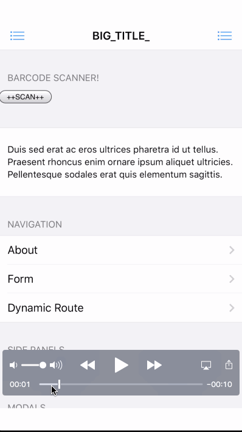

Framework7 + Vue + Cordova + Barcode scanner


Based almost entirely from: https://github.com/hazzo/framework7-vue-webpack-cordova-template

```
Credits: 

@nolimits4web
@hazzo

```

Change was adding in config.xml the following for [barcode scanner](https://github.com/phonegap/phonegap-plugin-barcodescanner/issues/540):

```xml
    <edit-config file="*-Info.plist" mode="merge" target="NSCameraUsageDescription">
        <string>The app needs access to the camera, to be able to read barcodes.</string>
    </edit-config>

```

==========

## Fresh clone steps:

```sh

npm i -g cordova 

npm i -g ios-deploy

npm i

npm run build

cd cordova 

cordova platform add ios browser

cordova plugin add https://github.com/phonegap/phonegap-plugin-barcodescanner.git

ln -s ../dist ./www

```

## Dev flow (Live reload)

```sh

npm run dev

```

## Dev Flow (build for device)

```sh

npm run build_native

```


## Issues

- Get rid of top/bottom margin

- Color/styling

- Icon, splashscreen




